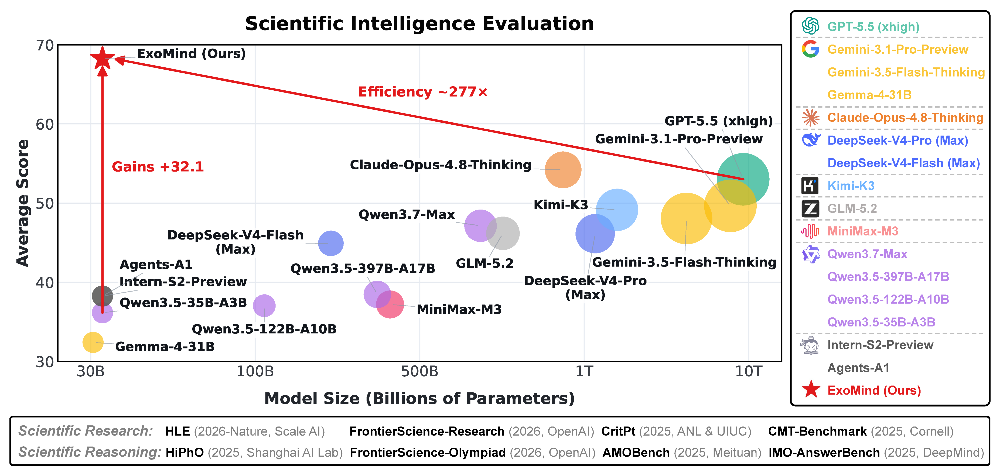
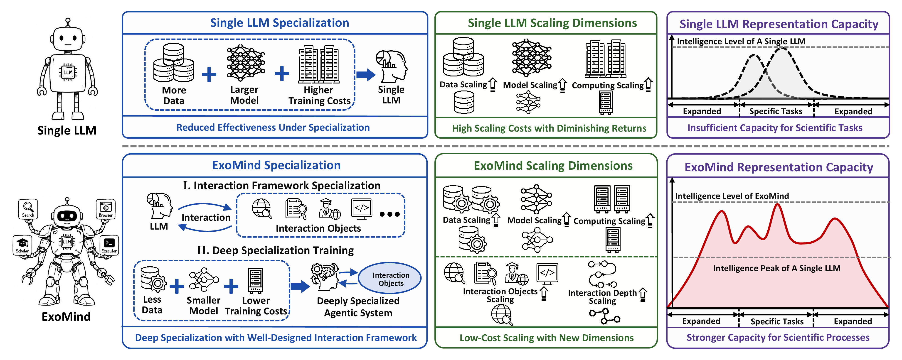
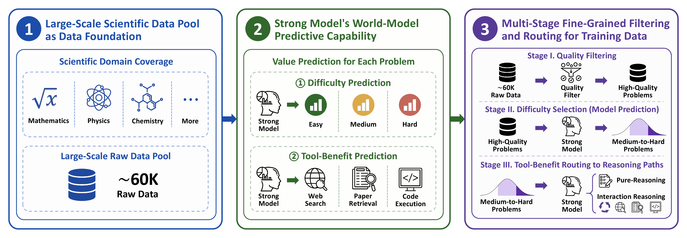
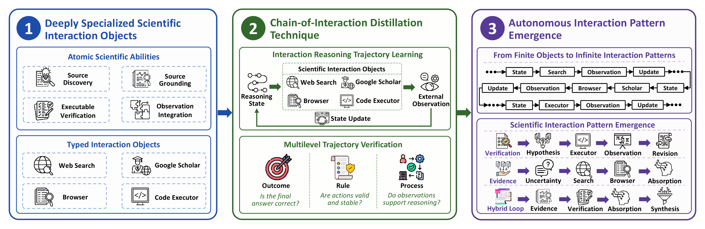
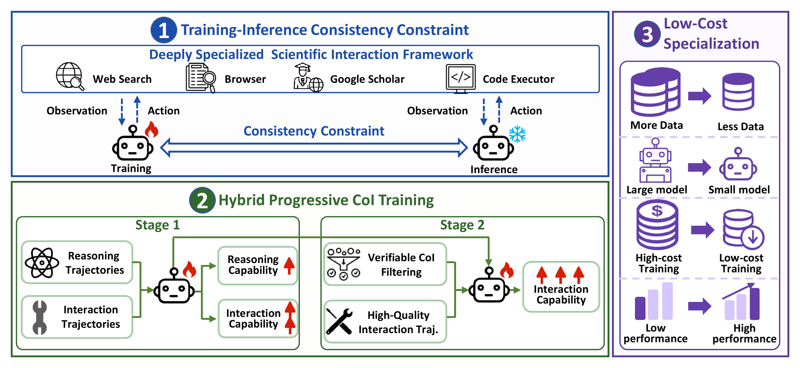

<div align="center">


<h1>ExoMind: Democratizing Scientific Intelligence via Extended-Mind-Inspired Agentic System</h1>

<p><strong>Surpassing Frontier Proprietary Models in Scientific Reasoning and Research<br>with Less Data, Small Model, and Low-cost Training</strong></p>

<p><strong>ExoMind Team · Shanghai Artificial Intelligence Laboratory</strong></p>

<p>
  <a href="https://ai4sgi.github.io/ExoMind/">
    
  </a>
  <a href="./Paper.pdf">
    
  </a>
</p>
<p>
  <a href="https://huggingface.co/AI4SGI/ExoMind#exomind-democratizing-scientific-intelligence-via-extended-mind-inspired-agentic-system">
    
  </a>
  <a href="https://github.com/AI4SGI/ExoMind">
    
  </a>
  <a href="https://modelscope.cn/models/AI4SGI/ExoMind">
    
  </a>
</p>

</div>

## 🔥 News

- **2026-08-12**: 🔥 We release the ExoMind technical report, official project page,
  and public repository.

## Overview

**ExoMind** is the first extended-mind-inspired agentic system designed for
scientific domains. It integrates a systematic data engineering pipeline, a
scientific interaction framework, and a systematic training strategy to enable
deep specialization at low cost.

Built on Qwen3.5-35B-A3B, ExoMind achieves substantial and consistent
improvements across scientific reasoning and research tasks using less data, a
small model, and low-cost training. Its average score across eight scientific
benchmarks increases from **36.2 to 67.5**, while it also improves over the base
model on all six evaluated general-capability benchmarks.

<p align="center">
  <a href="https://ai4sgi.github.io/ExoMind/#performance">
    
  </a>
</p>

<p align="center"><sub>Parameter counts marked with “~” are IKP-based estimates; the ~277× parameter-scale comparison uses the estimated ~9.7T parameters of GPT-5.5 (xhigh).</sub></p>

## Highlights

- **Extended-mind-inspired scientific intelligence:** Organizes an LLM,
  interaction objects, and autonomous interaction processes as a unified agentic
  system, enabling deep specialization, new scaling dimensions, and stronger
  representational capacity.
- **Training-value-aware data engineering:** Predicts problem difficulty and
  interaction benefit before trajectory generation, then performs quality
  filtering, difficulty selection, and capability routing.
- **Deeply specialized scientific interaction:** Abstracts source discovery,
  source grounding, executable verification, and observation integration into
  typed interaction objects under a unified action–observation contract, and
  distills verifiable Chain-of-Interaction trajectories.
- **Systematic progressive training:** Enforces training–inference consistency
  and progressively develops intrinsic reasoning and autonomous interaction
  through two-stage hybrid CoI training.
- **Low-cost frontier performance:** Using Qwen3.5-35B-A3B, a few thousand
  high-quality trajectories, and 1–2 days of full-parameter SFT on 8 NVIDIA H200
  GPUs, ExoMind attains the strongest average performance across eight evaluated
  scientific benchmarks and improves all six general-capability benchmarks over
  the base model.

## Intelligence Beyond a Single LLM

Rather than relying solely on the internal parameters and intrinsic capabilities
of a single LLM, ExoMind organizes intelligence as an agentic system composed of
an LLM, interaction objects, and autonomous interaction processes. Through
long-horizon autonomous interactions with diverse objects, this system develops
capabilities that extend beyond the boundaries of an individual LLM.

<p align="center">
  <a href="https://ai4sgi.github.io/ExoMind/#overview">
    
  </a>
</p>

- **Deep specialization:** Shifts the focus of specialization from modifying LLM
  parameters alone to designing external interaction objects tailored to
  different scientific tasks and domains.
- **New scaling dimensions:** Expands capability through richer interaction
  objects and deeper autonomous interactions, beyond model size, data volume,
  and training time.
- **Stronger representational capacity:** Better captures the diverse,
  fine-grained, and long-horizon characteristics of scientific processes.

## Building ExoMind

The construction of ExoMind follows three stages: a systematic data engineering
pipeline, a scientific interaction framework, and a systematic training strategy.

| Component | Role |
| --- | --- |
| **Systematic Data Engineering Pipeline** | Builds a roughly 60K multidisciplinary scientific problem–answer pool, predicts problem difficulty and interaction benefit before trajectory generation, applies quality filtering and difficulty selection to retain around 30K challenging problems, and then routes them to pure- or interaction-reasoning trajectories. |
| **Scientific Interaction Framework** | Abstracts source discovery, source grounding, executable verification, and observation integration as atomic capabilities, then instantiates Web Search, Google Scholar, Browser, and Code Executor as typed interaction objects under a unified action–observation contract; CoI distillation and multilevel trajectory verification produce high-quality interaction trajectories. |
| **Systematic Training Strategy** | A training–inference consistency constraint is applied so that the model learns to make better use of the interaction framework. Next, a two-stage hybrid progressive CoI training strategy is employed: Stage 1 jointly develops intrinsic reasoning and basic interaction capability, while Stage 2 further strengthens interaction reasoning with higher-quality interaction trajectories. This enables the model to develop both scientific reasoning and stronger autonomous interaction capability. |

<details>
<summary><strong>Systematic Data Engineering Pipeline</strong></summary>

<p align="center">
  <a href="https://ai4sgi.github.io/ExoMind/#approach">
    
  </a>
</p>

</details>

<details>
<summary><strong>Scientific Interaction Framework</strong></summary>

<p align="center">
  <a href="https://ai4sgi.github.io/ExoMind/#approach">
    
  </a>
</p>

</details>

<details>
<summary><strong>Systematic Training Strategy</strong></summary>

<p align="center">
  <a href="https://ai4sgi.github.io/ExoMind/#approach">
    
  </a>
</p>

</details>

## Performance

Under the technical report's evaluation setup, ExoMind reaches an
eight-benchmark average of **67.5**, compared with **54.2** for the next-best
representative model shown below.

<p>
🥇 Best score among the representative models shown
</p>

<table>
<thead>
<tr>
<th rowspan="2" align="left">Benchmark</th>
<th align="center">⭐ Ours</th>
<th colspan="7" align="center">Representative frontier models</th>
</tr>
<tr>
<th align="center">ExoMind<br>35B-A3B</th>
<th align="center">Claude-Opus-4.8<br>Thinking</th>
<th align="center">GPT-5.5<br>(xhigh)</th>
<th align="center">Gemini-3.1-Pro<br>Preview</th>
<th align="center">Kimi-K3</th>
<th align="center">Qwen3.7-Max</th>
<th align="center">GLM-5.2</th>
<th align="center">DeepSeek-V4-Pro<br>(Max)</th>
</tr>
</thead>
<tbody>
<tr><td colspan="9" align="left"><b>🧪 Scientific Research</b></td></tr>
<tr><td align="left">HLE w/ tools</td><td align="center">50.9</td><td align="center">🥇 57.9</td><td align="center">52.2</td><td align="center">51.4</td><td align="center">56.0</td><td align="center">53.5</td><td align="center">54.7</td><td align="center">48.2</td></tr>
<tr><td align="left">FrontierScience-Research</td><td align="center">🥇 70.0</td><td align="center">26.7</td><td align="center">26.7</td><td align="center">11.7</td><td align="center">21.7</td><td align="center">10.0</td><td align="center">15.0</td><td align="center">13.3</td></tr>
<tr><td align="left">CMT-Benchmark</td><td align="center">🥇 84.0</td><td align="center">46.0</td><td align="center">43.0</td><td align="center">43.0</td><td align="center">34.0</td><td align="center">34.0</td><td align="center">20.0</td><td align="center">28.0</td></tr>
<tr><td align="left">CritPt</td><td align="center">25.7</td><td align="center">20.9</td><td align="center">🥇 27.1</td><td align="center">17.7</td><td align="center">23.4</td><td align="center">13.4</td><td align="center">20.9</td><td align="center">7.1</td></tr>
<tr><td colspan="9" align="left"><b>🧠 Scientific Reasoning</b></td></tr>
<tr><td align="left">AMO-Bench</td><td align="center">🥇 78.0</td><td align="center">74.0</td><td align="center">70.0</td><td align="center">63.1</td><td align="center">64.0</td><td align="center">57.4</td><td align="center">54.0</td><td align="center">68.0</td></tr>
<tr><td align="left">IMO-AnswerBench</td><td align="center">🥇 92.8</td><td align="center">86.8</td><td align="center">83.8</td><td align="center">90.0</td><td align="center">82.8</td><td align="center">90.0</td><td align="center">91.0</td><td align="center">89.8</td></tr>
<tr><td align="left">HiPhO</td><td align="center">🥇 49.7</td><td align="center">46.4</td><td align="center">43.3</td><td align="center">43.4</td><td align="center">42.4</td><td align="center">38.8</td><td align="center">37.4</td><td align="center">38.7</td></tr>
<tr><td align="left">FrontierScience-Olympiad</td><td align="center">🥇 89.0</td><td align="center">75.0</td><td align="center">78.0</td><td align="center">77.0</td><td align="center">69.0</td><td align="center">80.0</td><td align="center">76.5</td><td align="center">76.0</td></tr>
<tr><td align="left"><b>Eight-benchmark average</b></td><td align="center">🥇 67.5</td><td align="center">54.2</td><td align="center">53.0</td><td align="center">49.7</td><td align="center">49.2</td><td align="center">47.1</td><td align="center">46.2</td><td align="center">46.1</td></tr>
</tbody>
</table>

See the [project-page evaluation
explorer](https://ai4sgi.github.io/ExoMind/#results) for the complete model list,
benchmark scope, evaluation settings, and interactive rankings.

## Citation

Please cite the ExoMind technical report as follows:

```bibtex
@misc{exomind2026,
  title  = {ExoMind: Democratizing Scientific Intelligence via Extended-Mind-Inspired Agentic System},
  author = {Peng Ye and Zhuo Liu and Jingqi Ye and Fangchen Yu and Shengji Tang and Yichen Jiang and Haonan He and Zongsheng Cao and Tao Chen and Bo Zhang and Wanli Ouyang and Bowen Zhou and Lei Bai},
  year   = {2026},
  note   = {Technical report},
  url    = {https://github.com/AI4SGI/ExoMind/blob/main/Paper.pdf}
}
```

## License

ExoMind uses a split-license structure:

- Software files expressly identified in the licensing overview are licensed
  under the [Apache License 2.0](./LICENSES/Apache-2.0.txt).
- The technical report, paper content, scientific figures and results, and
  ExoMind brand assets are **not** licensed under Apache-2.0. They are subject to
  the [ExoMind Research Content and Brand Terms](./CONTENT_RIGHTS.md), which
  permit limited attributed, noncommercial sharing and promotion while
  reserving manuscript and brand rights.
- Third-party materials remain subject to their respective owners' terms; see
  [NOTICE.md](./NOTICE.md).

See the repository's [licensing overview](./LICENSE) for the exact scope.
